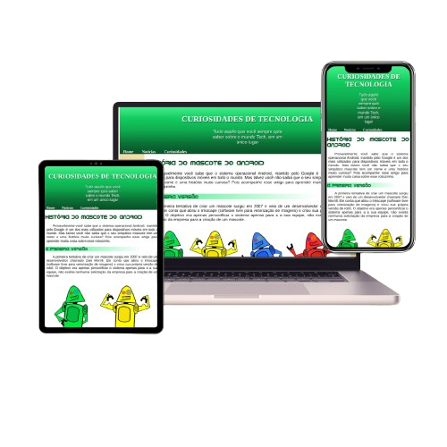

# História do mascote do Android

### Sobre
 Neste projeto pude por em prática meus conhecimentos da semântica do html 5 e do uso de fontes e variaveis em css. Você encontra nesse projeto a evolução cronológica do nosso mascote e algumas curiosidades.

### Links
 

   <strong>Veja o projeto : </strong>
   <a href="https://dionatan2019rodrigues.github.io/projeto-android" target="_blank" rel="external">Acesse aqui</a>
 

 
Desenvolvido dentro do 
   <a href="https://www.cursoemvideo.com/curso/html5-css3-modulo1/" target="_blank" rel="external">curso de html 5 e css 3</a> 
   , ministrado pelo professor Gustavo Guanabara no 
   <a href="https://www.cursoemvideo.com/" target="_blank" rel="external">Curso em Vídeo</a>.
 

   

